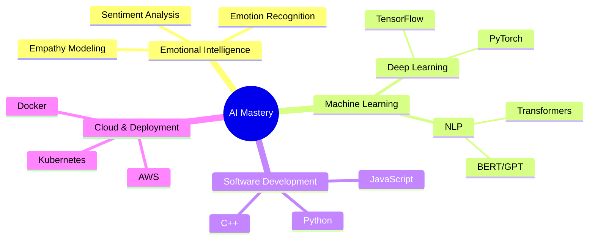

<div align="center">
  

  # Abhay Koul (OE-LUCIFER)
  
  [](https://github.com/OE-LUCIFER)
  [](https://huggingface.co/OEvortex)
  [](#)

  *Pioneering Emotionally Intelligent AI | Founder of HelpingAI*
</div>

---

<details open>
<summary><h2>👨‍💻 About Me</h2></summary>

<table>
  <tr>
    <td width="60%">

```yaml
name: Abhay Koul
age: 18
location: KP Colony, Vessu, Anantnag
started_ai: Started HelpingAI as my side project in 2022
focus: Emotionally Intelligent and Adaptive AI
mission: Democratizing advanced AI technologies
achievements:
  - Founded HelpingAI at 17
  - Developed industry-leading EQ models
  - Pioneered open-source emotional AI
hobbies:
  - Exploring cutting-edge AI research
  - Contributing to open-source projects
  - Advocating for ethical AI development
```

   </td>
    <td width="40%">
      
      <p align="center"><em>"Infusing AI with the power of emotional understanding."</em></p>
    </td>
  </tr>
</table>

<details>
<summary><strong>🌟 My AI Journey</strong></summary>

- 💡 Self-taught in advanced AI concepts
- 🏆 Rapidly progressed to creating state-of-the-art models
- 🌍 Vision to make AI more accessible and emotionally intelligent
- 🤝 Building a community of AI enthusiasts and developers

</details>

</details>

---

<details open>
<summary><h2>🚀 HelpingAI Ecosystem</h2></summary>

<div style="display: flex; justify-content: space-around; flex-wrap: wrap;">
  <div style="flex: 1; min-width: 300px; margin: 10px;">
    <h3 align="center">🌟 Model Series</h3>
    <table>
      <tr>
        <th>Model</th>
        <th>Parameters</th>
        <th>Key Features</th>
      </tr>
      <tr>
        <td><strong>HelpingAI-15B</strong></td>
        <td>15B</td>
        <td>
          • Superior emotional understanding<br>
          • Advanced context retention
        </td>
      </tr>
      <tr>
        <td><strong>HelpingAI2-9B</strong></td>
        <td>9B</td>
        <td>
          • High EQ, surpasses GPT-4<br>
          • Nuanced conversation handling
        </td>
      </tr>
      <tr>
        <td><strong>HelpingAI-Flash</strong></td>
        <td>2B</td>
        <td>
          • Optimized for mobile devices<br>
          • Quick, efficient responses
        </td>
      </tr>
    </table>
  </div>
  
  <div style="flex: 1; min-width: 300px; margin: 10px;">
    <h3 align="center">🌠 Core Innovations</h3>
    <ul>
      <li><strong>Open-Source Emotional AI:</strong> Democratizing access</li>
      <li><strong>Privacy-First Architecture:</strong> Protecting user data</li>
      <li><strong>Adaptive Personality:</strong> Tailored user experiences</li>
      <li><strong>Cross-Platform Compatibility:</strong> From servers to mobile</li>
      <li><strong>Continuous Learning:</strong> Ever-improving models</li>
    </ul>
  </div>
</div>

<details>
<summary><strong>🔬 Ongoing Research</strong></summary>

- Enhancing emotional intelligence across all model variants
- Exploring ethical implications of AI in various domains
- Developing more efficient mobile AI architectures
- Advancing privacy-preserving techniques in AI

</details>

</details>

---

<details open>
<summary><h2>💡 Technical Expertise</h2></summary>



### 🛠️ Tech Stack
<div align="center">


</div>

</details>

---

<details open>
<summary><h2>📊 GitHub Analytics</h2></summary>

<div align="center">
  
  
</div>

<div align="center">
  
</div>

<div align="center">
  
</div>

</details>

---

<details open>
<summary><h2>🌟 Featured Projects</h2></summary>

<div align="center">


<table>
  <tr>
    <td width="50%">
      <h3 align="center">HelpingAI Models</h3>
      <div align="center">
        <a href="https://huggingface.co/OEvortex" target="_blank">
          
        </a>
        <p>Explore our state-of-the-art emotionally intelligent AI models.</p>
        <a href="https://huggingface.co/OEvortex" target="_blank">
          
        </a>
      </div>
    </td>
    <td width="50%">
      <h3 align="center">Webscout</h3>
      <div align="center">
        
        <p>Search for anything using Google, DuckDuckGo, phind.com, Contains AI models, can transcribe yt videos, temporary email and phone number generation, has TTS support, webai (terminal gpt and open interpreter) and offline LLMs.</p>
        <a href="https://github.com/OE-LUCIFER/HelpingAI/tree/main/Webscout" target="_blank">
          
        </a>
      </div>
    </td>
  </tr>
</table>

</details>

---

<details open>
<summary><h2>🤝 Connect & Collaborate</h2></summary>

<div align="center">

[](mailto:helpingai5@gmail.com)
[](https://www.instagram.com/abhay_kaul_/)
[](https://twitter.com/a3hay)
[](https://www.linkedin.com/in/your-profile/)
[](https://huggingface.co/OEvortex)

</div>

</details>

---

<details open>
<summary><h2>💖 Support My Work</h2></summary>

<div align="center">

If you find value in my projects, consider supporting my work:

[](https://buymeacoffee.com/oevortex)
[](https://github.com/sponsors/OE-LUCIFER)

</div>

</details>

---

<div align="center">
  
  <h3>"Innovating at the intersection of AI and human emotion."</h3>
  © 2024 Abhay Koul | All rights reserved.
</div>

